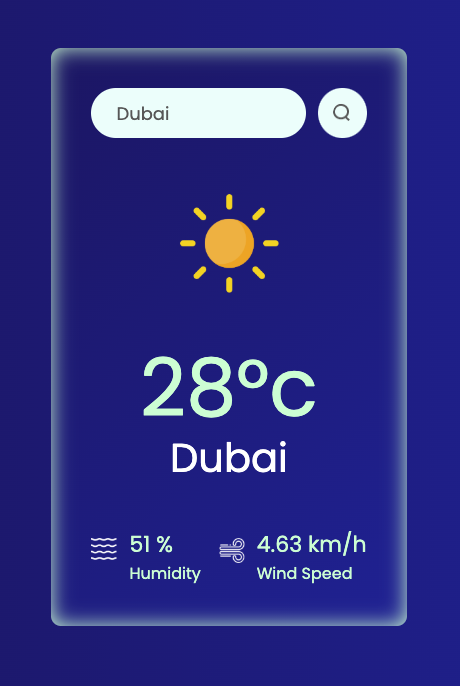

# 🌤️ Weather App

A simple and responsive weather application built with React and TypeScript. This app fetches real-time weather data from the OpenWeatherMap API and displays it in an intuitive interface.

---

## 🚀 Features
- 🌍 **Search Weather**: Get current weather data for any city in the world.
- 🖼️ **Dynamic Weather Icons**: Displays icons based on current weather conditions.
- 📊 **Detailed Metrics**: View humidity, temperature, and wind speed.
- 🧑‍💻 **Modern Stack**: Built with React, TypeScript, and CSS.

---

## 🛠️ Installation
1. **Clone the Repository**:
   ```bash
   git clone https://github.com/zeeshandevch/weather-app.git
   cd weather-app
   ```
2. **Install Dependencies**:
   ```bash
   npm install
   ```
3. **Set Up API Key**:
   - Create an account on [OpenWeatherMap](https://openweathermap.org/).
   - Generate an API key.
   - Create a `.env` file in the root directory and add:
     ```env
     VITE_APP_ID=your_api_key_here
     ```
4. **Run the Application**:
   ```bash
   npm run dev
   ```
5. **Open in Browser**:
   Visit `http://localhost:5173` to view the app.

---

## 🖼️ Screenshots
### Home Page


---

## 🧑‍💻 Built With
- **React**: Front-end library for building user interfaces.
- **TypeScript**: Strongly typed JavaScript for scalable development.
- **CSS**: For responsive and clean styling.

---

## 📁 Folder Structure
```
src
├── assets/         # Icons and images
├── components/     # Reusable React components
├── App.tsx         # Main application component
└── main.tsx        # Application entry point
```

---

## ⚠️ Known Issues
- Ensure you use the correct API key in the `.env` file.
- Typos in city names may result in no data or errors.

---

